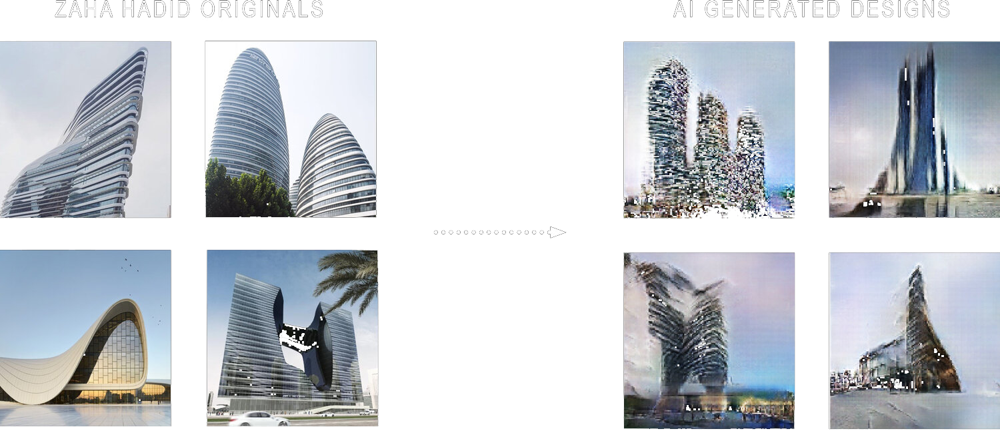
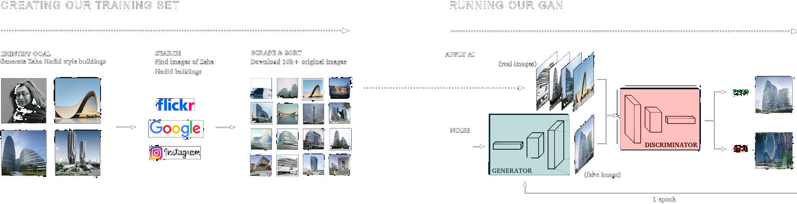
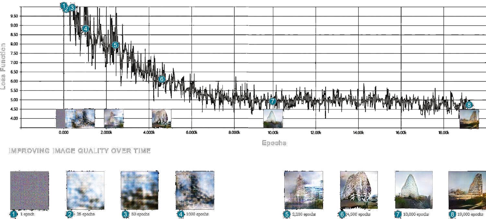

# GAN-Itecture


## About 

Gan-itecture is a research based project developed by Michael Hasey and Sage Elliot between 2019 and 2020 that leverages the latest computer-deep-learning neural networks to autonomously generate new architectural design imagery in the style of Zaha Hadid, one of the most renowned architects of recent time.  

<br>



## Colab Notebook

A colab notebook has been provided to recreate the following experiment

```
1_models/WGAN_GP.ipynb
```

## Project Page

An expanded description of GAN_Itecture can be found on its project page here:

```
https://www.michaelhasey.com/gan-exterior
```

## White Paper

A white paper description the GAN_Itecture project can be found here:

```
https://www.michaelhasey.com/publication_ganitecture
```


## Table of Contents

- [Background](#Background)
- [Pipeline](#Pipeline)
- [Dataset](#Dataset)
- [Model](#Model)
- [Implementation](#Implementation)
- [Performance](#Performance)
- [References](#References)
- [Citation](#Citation)

<br>

## Background

<br>

The primary goal of our research is to explore AI’s capacity to generate new 2-D images of building forms in a specific and assigned architectural style. To do this, we used the latest neural-network-based algorithms to create thousands of building-like images within a short span of time. For this study, we have used a powerful algorithm called W-GAN (Wasserstein Generative Adversarial Networks) to generate building-like images in the style of Zaha Hadid, one of the most renowned parametric-design oriented architects of recent time. 

Generative adversarial networks (GANs) are deep learning neural networks comprised of two algorithms that train each other to “learn” then “re-create” patterns of statistically significant phenomena found within pre-existing training sets of original data.  Original data may include images, music, text, and so on.  What makes GANs special is their ability to recreate new data that is incredibly similar to the originals, yet unequivocally unique.


<br>

## Pipeline

<br>

For this project, we used a 2 stage pipeline.

1. Creating a custom large 10k training dataset of images using my Archi-Base tool; An automated dataset creation tool that finds, labels, and sorts architectural imagery according to its class (image of building exterior, image of building interior, aerial image of building, etc.)

2. Training a W-GAN model to generate new and convincing images of building-like objects in the style of the training dataset.

<br>



<br>

## Dataset

<br>

For data, we used 10k labelled and sorted images of buildings designed by Zaha Hadid.  This dataset was created using my Archi-Base tool.  See the Archi-Base repo.


<br>

## Model

<br>

For this study, we have used a powerful algorithm called WWGAN-GP (Wasserstein Generative Adversarial Networks with Gradient Penalty) to generate building-like images in the style of Zaha Hadid, one of the most renowned parametric-design oriented architects of recent time.   This particular WGAN integrates a gradient penalty that prevents mode collapse.  Mode collapse, which results in a reduced variation of image output types, was a common problem in traditional WGAN.

<br>

## Implementation

<br>

To train the W-GAN model from scratch, follow the instructions and steps within the provided notebook in the repo.

```
1_models/WGAN_GP.ipynb
```

<br>

## Performance

<br>

“After many epochs, the discriminator and generator will have found an equilibrium, that allows the generator to learn meaningful information from the discriminator and the quality of the images will start to improve.  By observing images produced by the generator at specific epochs during training, it is clear that the generator is becoming increasingly adept at producing images that could have been drawn from the training set.” - David Foster, “Generative Deep Learning - Teaching Machines to Paint, Write, Compose and Play”, 2019.
Below is a graph illustrating how GAN performance increased in our own hands over time.  The values below represent the decreasing loss  function as the GAN improves after thousands of epochs (individual feedback loop cycles of the GAN algorithm).  The loss function is used by neural networks to compare its predicted output (generated Zaha designs) to the ground truth (real Zaha designs).  The lower the number, the better the network is performing.  As you can see, the decreasing loss function corresponds with increasingly accuracy and quality of generated Zaha Hadid building designs.

<br>



<br>

## References

<br>

1. WGAN-GP model [https://github.com/anshudaur/DeepLearning/blob/master/WGAN-GP.ipynb] (https://github.com/anshudaur/DeepLearning/blob/master/WGAN-GP.ipynb)

## Citation

<br>

If you find this project useful in your research, please consider citing:

``` 
@misc{mhasey2021,
    title={GAN-Itecture},
    author={Michael Hasey},
    year={2020},
}
```
